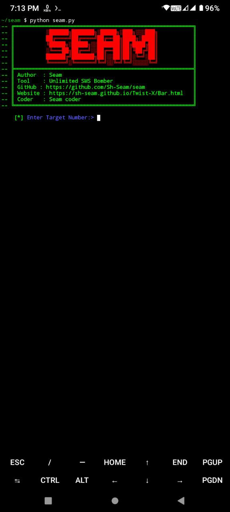

Most Updated SMS Bomber For Bangladeshi Numbers

# Note:
This tool is not Updated. For Python Updates, there was being some version error. Just solved that version error.

So, don't be excited about the Update😅. This is the same old ToxicBomber.

### Version 3.0 Updates:
<li>New Interface</li>
<li>Removed Dead APIs</li>
<li>Added New API</li>
<li>Unlimited Bombing</li>
<li>Removed Bugs</li>

### Installation Commands :
``` shell script
apt update -y
apt upgrade -y
pkg install python -y
pkg install git -y
pip install requests
git clone https://github.com/Sh-Seam/seam
cd seam
python seam.py
```

### Installation Commands by 1 command:

``` shell script
apt update -y && apt upgrade -y && pkg install python -y && pkg install git -y && pip install requests && git clone https://github.com/Sh-Seam/seam && cd seam && python seam.py
```

## Note:
<li>This Tool Is Only For Educational Purpose</li>
<li>ToxicNoob Will Never Be Responsible For Any Misuse</li>
<li>Use It At Your Own Risk</li>

## Contact :
For Any Help or Suggestions, Contact With Us:
<li> Via <a href="https://wwww.facebook.com/sh.seam.0">Facebook</a>
<li> Via <a href="https://chat.whatsapp.com/G27GqrQZiBbGrfj6BHDsBi">WhatsApp</a>
<li> Via <a href="https://m.me/sh.seam.0">Messenger</a>
<li> Via <a href="mailto: shseam01@gmail.com">Email</a>
<li> Via <a href="https://sh-seam.github.io/Twist-X/Bar.html">Website</a>


# Screenshot:



